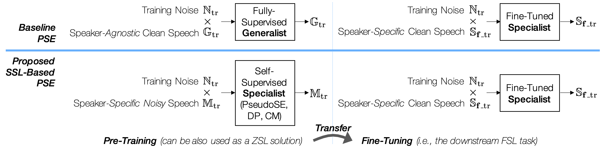

# Efficient Personalized Speech Enhancement through Self-Supervised Learning

[Aswin Sivaraman](https://actuallyaswin.github.io/) and [Minje Kim](https://saige.sice.indiana.edu)

<!--  -->

## Abstract
This work presents self-supervised learning (SSL) methods for developing monaural speaker-specific (i.e., personalized) speech enhancement (SE) models. While generalist models must broadly address many speakers, specialist models can adapt their enhancement function towards a particular speaker's voice, expecting to solve a narrower problem. Hence, specialists are capable of achieving more optimal performance in addition to reducing computational complexity. However, naive personalization methods can require clean speech from the target user, which is inconvenient to acquire, e.g., due to subpar recording conditions. To this end, we pose personalization as either a zero-shot learning (ZSL) task, in which no additional clean speech of the target speaker is used for training, or a few-shot learning (FSL) task, in which the goal is to minimize the duration of the clean speech used for transfer learning. With this paper, we propose self-supervised learning methods as a solution to both zero- and few-shot personalization tasks. The proposed methods are designed to learn the personalized speech features from unlabeled data (i.e., in-the-wild noisy recordings from the target user) without knowing the corresponding clean sources. Our experiments investigate three different self-supervised learning mechanisms. The results show that self-supervised models achieve zero-shot and few-shot personalization using fewer model parameters and less clean data from the target user, achieving the data efficiency and model compression goals.

<figure>
    
    <figcaption>An overview of the baseline and proposed personalization methods. With the baseline, the SE model is first pretrained using a large speaker-agnostic dataset as a generalist and then finetuned using clean speech signals of the test user. This method relies entirely on the finetuning process for personalization. On the other hand, the proposed methods provide various SSL options to pretrain the model using noisy, but speaker-specific speech, which serve a better initialization point for the subsequent finetuning process, leading to better SE performance. The pretrained models can also conduct a certain level of SE as a ZSL model, while the FSL-based finetuning tends to improve the pretrained model.</figcaption>
</figure>

## Proposed Methods

### Pseudo Speech Enhancement (PseudoSE)

### Contrastive Mixtures (CM)

### Data Purification (DP)

